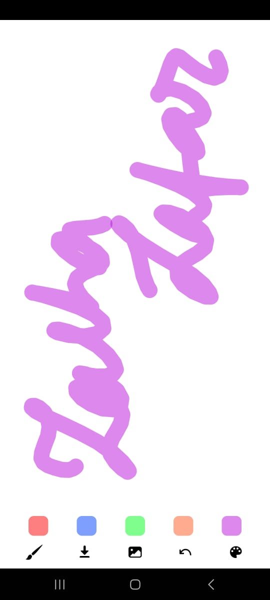
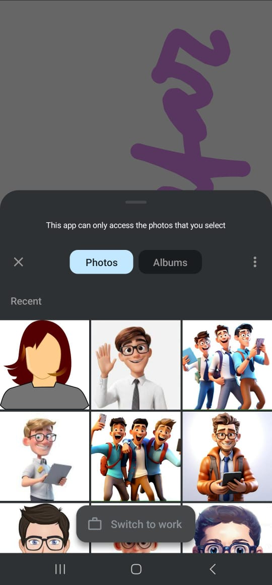

# INTRODUCTION 
## Drawing App – Creative Canvas Drawing Experience
Drawing App is a lightweight yet powerful canvas-based drawing application that lets users unleash their creativity with ease. Whether you're sketching freely or marking over imported images, this app provides a smooth and intuitive drawing experience with essential tools for artists and casual doodlers alike.

Designed with a focus on simplicity and functionality, it includes dynamic brush tools, color selection, and support for image overlay and export — all packed into a responsive and user-friendly interface.

## 🌟 Features
✏️ Free Drawing on Canvas
Draw anything you like using touch input or mouse with smooth canvas rendering.

🎚️ Adjustable Brush Size
Fine-tune your brush for detailed work or bold strokes.

🎨 Color Picker
Choose from a wide range of colors to personalize your artwork.

🖼️ Import Photos
Load images from your gallery and draw over them with ease.

💾 Save as Image
Export your drawing or edited photo to your device in a single tap.

📱 Clean & Minimal UI
A distraction-free interface that keeps the focus on creativity.

## 📸 User Interface
### ✏️ Simple Canvas Drawing

### 🖼️ Selecting a Photo from Gallery

### 🖌️ Drawing Over an Imported Image

### 🎨 Color Picker in Action

